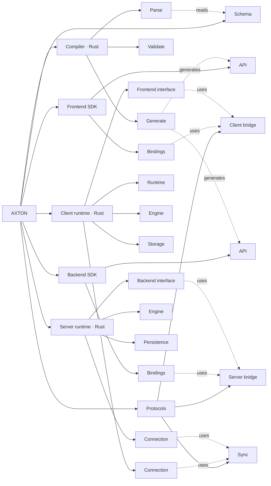

# Architecture

See the [component documentation index](architecture/README.md) for individual design documents. Protocol 5 behavior is owned by [protocol 5](architecture/protocols/sync.md), [client storage](architecture/client/storage/protocol5.md), [the server](architecture/server/protocol5.md) and [current guarantees](guarantees.md). Protocol 4 and older carrier pages are historical references; they do not promise a supported migration. See [adoption](protocol5-adoption.md) for fresh-file and release gates.

## Core

Five parts carry the product: three define what synchronization guarantees, two define what a developer writes against. Design discussions start here; everything else adapts to them.

| Core part | Why |
| --- | --- |
| [Protocol](architecture/protocols/sync.md) | The shared wire contract: bound contexts, Stream positions, immutable Batches, null-cursor snapshots and finite complete delivery units. |
| [Client / Engine](architecture/client/storage/protocol5.md) | Local transactions, durable named Mutations, Stream authority, read protection and committed settlement. |
| [Client / Frontend interface](architecture/frontend-sdk/api.md) | One client/file/Stream, local Model reads and writes, typed Mutations, Query/Fetch and Bootstrap. The [runtime](architecture/client/runtime.md) owns scheduling. |
| [Server / Engine](architecture/server/protocol5.md) | Fenced publication and materialization, explicit tracking, durable outcomes and finite delivery coverage. |
| [Server / Backend interface](architecture/server/backend-interface.md) | What a backend author writes against: the host contract between handlers/loaders and the engine. |

The compiler generates typed APIs. SDK Bindings and connections carry messages, storage and persistence are adapters, and the schema is input. Rust interfaces wire contract messages to runtime work; Protocols own the message definitions.

## Components

The tree stops at three levels: AXTON, a component, a part. A part that has internal structure keeps its own tree in its README and owns every page below it; nothing deeper appears here.

- **[Schema](architecture/schema/README.md)** — Models, inheritance, fields, identities, named Mutations, Queries and bootstrap selection.
  - **[Types](architecture/schema/types.md)** — Scalar and enum types, lists and nullability.
  - **[Models](architecture/schema/models.md)** — Fields, identities, unique constraints and read-contract versions.
  - **[Relations](architecture/schema/relations.md)** — References, inverse relations and deletion rules.
  - **[Slot definitions](architecture/schema/mutations.md)** — Model operation groups, argument bindings, versions and sequencing used by named Mutations.
  - **[Mutations and Queries](architecture/schema/actions.md)** — Versioned backend operations: business kind, inputs, outputs and delivery defaults.
  - **[Prerequisites](architecture/schema/prerequisites.md)** — Prerequisite declarations and references.
- **[Protocols](architecture/protocols/README.md)** — Message types, codecs and pure validation.
  - **[Sync](architecture/protocols/sync.md)** — Client ↔ Server.
  - **[Client bridge](architecture/protocols/client-bridge.md)** — Frontend SDK ↔ Rust client.
  - **[Server bridge](architecture/protocols/server-bridge.md)** — Backend SDK ↔ Rust server.
- **[Compiler (Rust)](architecture/compiler/README.md)** — Compile schemas and generate typed interfaces.
  - **[Parse](architecture/compiler/parse.md)** — Convert schema text into structured definitions.
  - **[Validate](architecture/compiler/validate.md)** — Check types, references and mutations in the parsed definitions.
  - **[Generate](architecture/compiler/generate.md)** — Produce runtime descriptors and typed SDK interfaces from validated definitions.
- **[Frontend SDK](architecture/frontend-sdk/README.md)** — Typed client calls and their language/native adapters.
  - **[API](architecture/frontend-sdk/api.md)** — Application-facing reads, writes, Mutations, Query/Fetch and Bootstrap.
  - **[Bindings](architecture/frontend-sdk/bindings.md)** — Client bridge routing and platform effects.
- **[Backend SDK](architecture/backend-sdk/README.md)** — Backend registration and its language/native adapters.
  - **[API](architecture/backend-sdk/api.md)** — Handler/Loader registration, Stream selectors and backend construction.
  - **[Bindings](architecture/backend-sdk/bindings.md)** — Native invocation and retained host dispatch.
- **[Client runtime (Rust)](architecture/client/README.md)** — Local state, storage and sync.
  - **[Runtime](architecture/client/runtime.md)** — Own every task from submission to outcome: scheduling, the application transaction, the connection lanes, direct calls and observers.
  - ★ **[Frontend interface](architecture/client/frontend-interface.md)** — Expose bound reads, writes, finite initialization and status to the runtime.
  - ★ **[Engine](architecture/client/engine/README.md)** — Local reads and writes, the mutation queue, completion from receipts and page application.
  - **[Storage](architecture/client/storage/README.md)** — Execute Engine-requested SQL and transactions; table layout, schema compatibility and replica rebuild.
  - **[Connection](architecture/client/connection/README.md)** — HTTP/WebSocket transport and the controller that decides when to push, stream, catch up and retry.
- **[Server runtime (Rust)](architecture/server/README.md)** — Sync protocol and backend execution.
  - ★ **[Backend interface](architecture/server/backend-interface.md)** — Invoke application handlers and loaders through one typed host contract.
  - ★ **[Engine](architecture/server/engine/README.md)** — Process mutations, read their results back, publish, serve pulls and produce receipts.
  - **[Persistence](architecture/server/persistence.md)** — Persist sync metadata within the application's transaction; no business logic.
  - **[Connection](architecture/server/connection/README.md)** — HTTP/WebSocket transport, subscriptions and streaming.

## Component graph

Components and their parts; each part's own structure is drawn in its README. Both connection controllers are Rust: the client's protocol-5 Uplink and DeltaApplier, driven by the client [runtime](architecture/client/runtime.md), and the server's subscription controller (`Subscriptions`); the language packages execute their effects or actions and keep no sync decision.

Solid lines show composition; dashed lines show schema generation or contract use.

## Code map

Where each part lives. A part with its own tree carries the finer map in its README; every leaf page names its code in section 5.

| Component / part | Code location |
|---|---|
| Schema | Source syntax in [compiler/parse.rs](../../crates/compiler/src/parse.rs) |
| Protocols / Sync | [protocols/sync.rs](../../crates/protocols/src/sync.rs) and pure delivery/mutation helpers; [core/protocol.rs](../../crates/core/src/protocol.rs) retains shared scalar bounds. |
| Protocols / Client bridge | [protocols/client_bridge](../../crates/protocols/src/client_bridge) owns messages and local/query DTOs. |
| Protocols / Server bridge | [protocols/server_bridge](../../crates/protocols/src/server_bridge) owns host requests/responses, member DTOs and structured errors. |
| Compiler / Parse | [compiler/parse.rs](../../crates/compiler/src/parse.rs); file concatenation and error relocation in [compiler/main.rs](../../crates/compiler/src/main.rs) |
| Compiler / Validate | `validate` and the `Validated` types in [compiler/validate.rs](../../crates/compiler/src/validate.rs); version history and fence in [compiler/history.rs](../../crates/compiler/src/history.rs) |
| Compiler / Generate | Descriptors in [compiler/generate.rs](../../crates/compiler/src/generate.rs), represented by [core/schema.rs](../../crates/core/src/schema.rs); typed interfaces in [compiler/emit.rs](../../crates/compiler/src/emit.rs); output files in [compiler/main.rs](../../crates/compiler/src/main.rs) |
| Frontend SDK / API | [Node API](../../packages/frontend/client-js/api), [Dart API](../../packages/frontend/dart/lib/src/api), [RN API](../../packages/frontend/client-react-native/api); typed Model/Mutation facades are compiler output. |
| Frontend SDK / Bindings | [Node](../../packages/frontend/client-js/bindings), [Dart](../../packages/frontend/dart/lib/src/bindings), [RN](../../packages/frontend/client-react-native/bindings); shared native carriers remain in [bindings](../../bindings). |
| Backend SDK / API | [Server API](../../packages/backend/server/api); typed registration contracts are compiler output. |
| Backend SDK / Bindings | [Server bindings](../../packages/backend/server/bindings) call native and dispatch the host with retained context; [PostgreSQL](../../packages/backend/postgres/src) adapts persistence. |
| Client / Runtime | [client/runtime](../../crates/client/src/runtime) (`ClientRuntime`; `protocol.rs` re-exports the extracted Client bridge) ([modules](architecture/client/runtime.md#5-building-block-view)) |
| Client / Frontend interface | [client/frontend_interface.rs](../../crates/client/src/frontend_interface.rs); per-transaction handle in [client/engine.rs](../../crates/client/src/engine.rs) |
| Client / Engine | [sync05](../../crates/client/src/sync05), [store05.rs](../../crates/client/src/store05.rs) and [settlement05.rs](../../crates/client/src/settlement05.rs) own durable Batches, finite apply and queue-owned settlement. |
| Client / Storage | [client/store.rs](../../crates/client/src/store.rs), [client/ddl.rs](../../crates/client/src/ddl.rs), [client/store05.rs](../../crates/client/src/store05.rs), [sqlite/lib.rs](../../crates/sqlite/src/lib.rs) ([map](architecture/client/storage/README.md)) |
| Client / Connection | [runtime/lanes.rs](../../crates/client/src/runtime/lanes.rs), [sync05/downlink.rs](../../crates/client/src/sync05/downlink.rs), [sync05/delivery_queue.rs](../../crates/client/src/sync05/delivery_queue.rs); effect executors in [Node connection](../../packages/frontend/client-js/bindings/connection.mts) and [Dart connection](../../packages/frontend/dart/lib/src/bindings/connection.dart) ([map](architecture/client/connection/README.md)) |
| Server / Backend interface | [backend_interface.rs](../../crates/server/src/backend_interface.rs) owns Host/typed invocation; [Server bridge](../../crates/protocols/src/server_bridge) owns operation definitions; [SDK bindings](../../packages/backend/server/bindings) dispatch application callbacks. |
| Server / Engine | [server/protocol_v05.rs](../../crates/server/src/protocol_v05.rs), [mutation_batch.rs](../../crates/server/src/mutation_batch.rs) and [delivery_plan.rs](../../crates/server/src/delivery_plan.rs) dispatch protocol-5 work through the shared host. The [Backend SDK API](../../packages/backend/server/api) exposes publication and connection construction; its [Bindings](../../packages/backend/server/bindings) invoke the engine. |
| Server / Persistence | `Database<T>` exposed by the [Server API](../../packages/backend/server/api); SQL, driver interface and the `pg`/`prisma`/`drizzle` shims in [packages/backend/postgres](../../packages/backend/postgres); tables in [migration.sql](../../packages/backend/postgres/migration.sql) |
| Server / Connection | HTTP and WebSocket construction in the [Server API](../../packages/backend/server/api); controller `Subscriptions` in [server/live.rs](../../crates/server/src/live.rs) ([map](architecture/server/connection/README.md#code-map)) |
