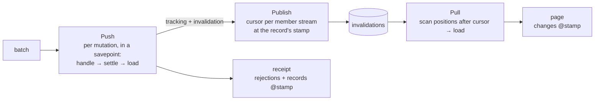

# Engine

The engine admits Store/Stream/context and exact immutable intent before application work. It saves each Mutation result with business effects, publishes under a fence and freezes finite delivery after preparation closure. Ordinary reads return null-cursor snapshots; settlement-owned materialization changes no enrollment or range prefix. Replay does not rerun saved preparation.

[Protocol 5](../../protocol/0.5.md) owns the shared contract; [implementation](../../../../../crates/server/src/protocol_v05.rs) owns this component. Earlier carrier mechanics below are historical references, not current public contracts.

[Protocol 4](../protocol4.md) owns current bound-request execution, fenced Stream publication and materialization. The stamp, legacy batch and Load descriptions below document retained protocol-3 machinery, not alternative 0.4 authority paths.

The server engine is pure protocol logic in Rust: it never opens a connection or a transaction itself, but drives the host through a fixed set of operations.

- [Push](push.md) — Validate and deduplicate legacy mutation batches, invoke handlers and produce receipts.
- Operation execution — Claim each Mutation or Query call independently, run its handler in a savepoint, refuse a Query settlement with effects, resolve Model outputs through versioned loaders and save its result for immutable replay.
- [Pull](pull.md) — Find changes by stream cursor and invoke loaders to return records.
- [Publish](publish.md) — Combine tracking and invalidation: one stamp per invalidated identity, one cursor per affected final Stream/record pair.
- [Loads](loads.md) — Run each native Load page in its own application transaction: claim, Handler (no business writes, Stream restricted to tracking enrollment), batched Loader and stamp resolution, enrollment settlement, saved outcome and replay by call ID.

## How the parts work together

Shared settlement advances one stamp per invalidated identity; publication positions and Pull carry that authority.

The operation executor also runs inside the application's transaction, for both kinds and both delivery paths. It claims a canonical call before validating its arguments, so a retry returns that call's saved result even after a later batch. A fresh call settles its changed records (globally invalidated input targets plus handler declarations), then reads its input targets and explicit Model outputs through loaders; an explicit Model output reuses the stamp settlement allocated or acquires the record's stamp before loading, without advancing it. Input targets are mandatory caller authority; explicit outputs are caller authority only as the call's `store` policy selects; an extra invalidation alone is never caller authority, so it may name a Model the caller did not declare. Outputs are never filled from inputs, even when names match ([Mutations and Queries](../../schema/actions.md#3-context-and-scope)). A Query whose settlement carries invalidation or tracking is rejected with `query.effects_forbidden` before any stamp, readback or publication ([Mutations and Queries](../../schema/actions.md#8-crosscutting-concepts)). A rejected call rolls back its own savepoint, while a persistence fault aborts the transaction. The legacy mutation path described in [Push](push.md) remains available.

A handler writes to the application's database, may track records in Streams and may invalidate them globally or for selected Streams. Inferred changed Mutation inputs invalidate globally. When it returns, the shared settlement ([Publish](publish.md)) allocates one new version number (the *stamp*) per changed record and gives each affected Stream/record pair one new position (the *cursor*) at the record's current stamp, stored in the invalidation table; tracking alone ensures a stamp without advancing existing authority. Settlement uses bulk tracking reads, canonical Stream locks, mixed record guards, re-read/retry and final pair application; [Publish](publish.md) owns the algorithm. Push then reads the uploaded targets back through the application's loaders at the version the client declared and puts that content, with its stamp, in the receipt; extra changes are distributed but not read back. When a client pulls that stream, [Pull](pull.md) scans the invalidation table past the client's cursor and asks the loaders for the current rows of upserts, returning them with the records' current stamps. Retained historical removals carry identity-only evidence without a Loader call; authority absence retains tracking. The client completes the mutation from the receipt alone and applies content from every path in stamp order, so a receipt and a page for the same change agree, and the same record can be published to several streams without conflict.

## Code map

| Part | Code location |
|---|---|
| Push | [server/lib.rs](../../../../../crates/server/src/lib.rs) (`process_push`, `decode`); input-target readback in [server/readback.rs](../../../../../crates/server/src/readback.rs) (`read_back`) |
| Operations | [server/actions.rs](../../../../../crates/server/src/actions.rs) (`execute_action`, `process_action_push`); host dispatch in [server/index.mts](../../../../../packages/server/index.mts) |
| Model Fetch | [server/fetch.rs](../../../../../crates/server/src/fetch.rs) (`process_fetch`); the call ledger protocol it shares with Operations in [server/calls.rs](../../../../../crates/server/src/calls.rs) ([Direct calls](../../protocol/actions.md#model-fetch)) |
| Pull | [server/lib.rs](../../../../../crates/server/src/lib.rs) (`process_pull`) |
| Loads | [server/loads.rs](../../../../../crates/server/src/loads.rs) (`validate_load_batch`, `process_load`, `encode_load_batch`); HTTP carrier in [server/index.mts](../../../../../packages/server/index.mts) |
| Publish | shared settlement in [server/settlement.rs](../../../../../crates/server/src/settlement.rs) (`settle_changes`); the external path in [server/lib.rs](../../../../../crates/server/src/lib.rs) (`settle_external`); the declaration collector `createEffects` in [server/effects.mts](../../../../../packages/server/effects.mts); `transaction` and `WakeHub` in [server/index.mts](../../../../../packages/server/index.mts) |
