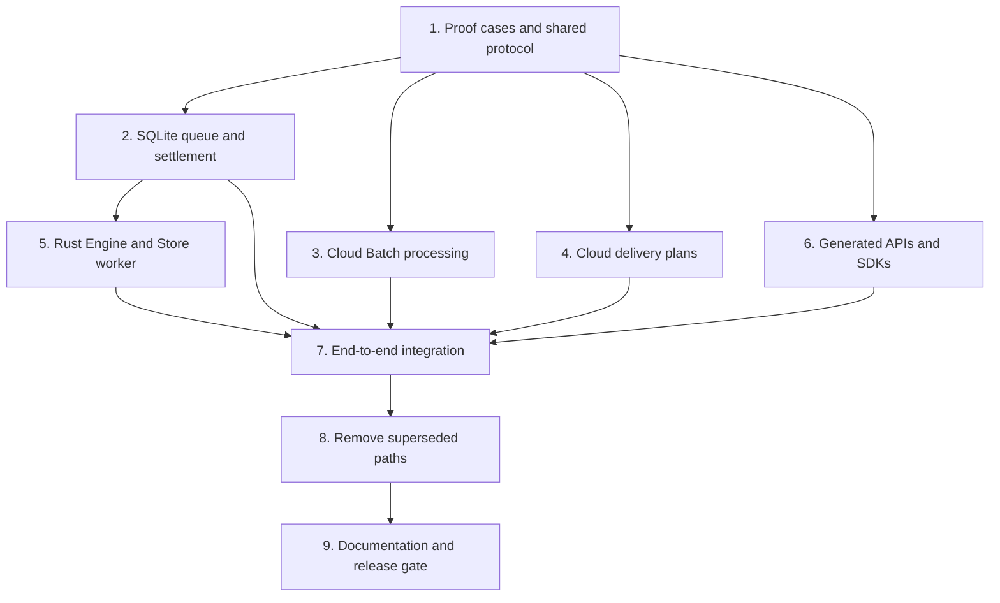

# AXTON Internal Refactor Implementation Plan

> **For agentic workers:** REQUIRED SUB-SKILL: Use superpowers:subagent-driven-development (recommended) or superpowers:executing-plans to implement this plan task-by-task. Steps use checkbox (`- [ ]`) syntax for tracking.

**Goal:** Replace the overlapping 0.4 execution paths with the agreed Batch uplink and range-queue Downlink, preserving offline work and simplifying the two specified public APIs.

**Architecture:** Rust owns the control task and the single-writer Store worker. Typed SDKs retain the existing bridge carrier and execute network effects. Stable delivery plans bridge compacted cloud state to atomic local units.

**Tech Stack:** Rust workspace, rusqlite, PostgreSQL Serializable transactions, TypeScript/Node bindings, generated Dart and React Native facades.

## Global Constraints

- One Client exclusively owns one physical SQLite file and one Stream.
- SDKs expose language-facing APIs and perform network I/O. Rust owns orchestration, persistence, retries, apply, settlement and notifications.
- Preserve the open/submit/drain/detach binding carrier and request/effect/event correlation.
- One unacknowledged Mutation Batch per Store; batch IDs increase strictly by one.
- One cloud database transaction per Mutation, not per Batch.
- One publication cursor per Mutation per affected Stream; equal cursors are legal.
- Track is explicit. Query/Fetch output never automatically enrolls a record.
- Query/Fetch records have cursor:null. Both store:true and store:false remain available; the default is true.
- No onStore hooks, per-record stamps or new generic one-time-load API.
- The frozen design document is not edited by implementation tasks.
- Fresh-file implementation comes first. Opening an unsupported existing Store must fail without altering it.

The [specification](../specs/2026-10-07-internal-refactor-spec.md) is the target; the [review](../specs/2026-10-07-internal-refactor-review.md) explains its proposed refinements. This plan is not execution authorization. No code or code tests were run while writing it.

Start from v0.4.2 (`98891f9be99aa89fe237612377d65e5acafce9a1`) or newer integrated main. The notes worktree is older; carry the documents forward without dropping release fixes or editing the original notes. Recheck the file map against the selected base before coding.

## Dependency and ownership map



After Task 1 freezes messages, Tasks 2, 3, 4 and the facade portion of 6 can proceed independently using the same fixtures. Task 5 can use recorded server deliveries while 3/4 finish. Task 7 joins them. Shared protocol changes go through Task 1's owner; do not independently redefine envelope fields.

If delegated later, use separate worktrees and branches. Tasks 3/4 share PostgreSQL schema/driver files: one integration owner applies those edits, or their schema commits land sequentially. Task 6 owns `crates/compiler/src/emit.rs`; Task 5 owns bindings/common actor wiring. This plan does not start agents or create branches.

The nine tasks are review boundaries, not a promise of nine PRs. A failure of a proof/capacity gate blocks deletion of its old protection, not unrelated work.

## Shared implementation interfaces

Task 1 exports `axton_core::v05` with the spec's `MutationRequest`, `BatchAcknowledgement`, `SettlementTarget`, `DeltaRequest`, `DeliveryHeader`, `DeliveryUnit`, `AuthorityChange` and `RecordKey`. Use the existing core `Result<T>` and schema normalization rather than SDK-specific validation copies.

```rust
pub fn validate_batch(request: &MutationRequest) -> axton_core::Result<()>;
pub fn batch_digest(request: &MutationRequest) -> axton_core::Result<String>;
pub fn validate_acknowledgement(
    request: &MutationRequest,
    acknowledgement: &BatchAcknowledgement,
) -> axton_core::Result<()>;
pub fn validate_delivery(
    header: &DeliveryHeader,
    units: &[DeliveryUnit],
) -> axton_core::Result<()>;
```

The digest function ignores the digest field, validates checked counters and hashes canonical JSON with the domain `axton:mutation-batch:5`. Delivery hashes use `axton:delivery-plan:5` and bind header scope, ordered unit coverage and payload. No type here owns database/network I/O.

Native Task/Effect/Event carriers remain in `crates/client/src/runtime/protocol.rs`. Extend payloads there; do not add another JS/Dart transport protocol around them. The Rust components below use these core messages; their DB methods operate within the existing Store/host transaction abstractions.

## Task 1: Prove coverage and freeze the shared contract

**Files**

- Create: `crates/core/src/protocol_v05.rs`, `crates/core/tests/protocol_v05.rs`, `fixtures/protocol/0.5.json`.
- Modify: `crates/core/src/lib.rs`.
- Create: `crates/sim/tests/protocol05_coverage.rs`.
- Read: `crates/core/src/protocol_v04.rs`, `crates/client/src/progress04.rs`, `packages/postgres/src/sql.mts`.

**Produces:** the four validation functions above, serialized fixtures for every message, deterministic proof cases A1/A5/A6/A7/A8/A14/A15. These cases specify inputs and expected state, not mock assertions that only repeat implementation steps.

- [ ] Encode strict protocol-5 messages, optional/no-progress unit coverage and settlement/schema materialization envelopes. Reject protocol 4, unknown envelope fields, unsafe counters, duplicate IDs, changed digests and wrong Stream/context.
- [ ] Add the compacted Bootstrap case below before writing the replacement planner. The oracle is the selected current projection frozen at H, overlaid with later authority already installed locally.

```json
{
  "case": "bootstrap_record_moves_past_start",
  "startCursor": 40,
  "bootstrapCursor": null,
  "before": [{"model": "Entry", "id": "e", "cursor": 20, "text": "a"}],
  "atPlan": [{"model": "Entry", "id": "e", "cursor": 45, "text": "b"}],
  "observedHead": 45,
  "expected": {"bootstrapCursor": 40, "entryText": "b", "entryCursor": 45}
}
```

- [ ] Add variants: move again after plan freeze, remove after a committed page, expire mid-unit, no selected Models, S=0 with newer records, and concurrent Sync installing 46 before Bootstrap's 45. B must not become S while any required plan unit is uncommitted.
- [ ] Add unique transfer A owns x -> A releases at 2 -> B owns x at 3 -> A changes at 5. Permute transport fragments and crash between units. The final committed projection must equal the valid final candidate projection; no intermediate unique violation may leak or be bypassed.
- [ ] Add shared-cursor records split over network pages; unit completeness, not page arrival or maximum record cursor, controls progress.
- [ ] Model receipt-before-data, data-before-receipt, untracked target, later Remove, no-op and target older than S. Verify that numeric C alone never settles a missing tracked target.
- [ ] Run `cargo test -p axton-core --test protocol_v05 --locked` and `cargo test -p axton-sim --test protocol05_coverage --locked`. First confirm failure of the naive bounded scan/single-record apply, then require the recommended plan/unit algorithms to pass. No implementation may remove manifests/PublicationGroup before these cases pass.
- [ ] Freeze fixtures and commit this contract boundary. If the recommended mechanism fails, revise the new spec and plan; keep the original design unchanged and report any material change to its promised behavior.

## Task 2: Build one durable local Mutation lifecycle

**Files**

- Create: `crates/client/src/store05.rs`, `crates/client/src/mutation_queue.rs`, `crates/client/src/settlement05.rs`.
- Modify: `crates/client/src/lib.rs`, `crates/client/src/ddl.rs`, `crates/client/src/mutate.rs`, `crates/client/src/queue.rs`, `crates/client/src/authority.rs`, `crates/client/src/rows.rs`, `crates/client/src/runtime/transactions.rs`.
- Create: `crates/sqlite/tests/protocol05_queue.rs`, `crates/sqlite/tests/protocol05_settlement.rs`.
- Reuse behavioral fixtures from `crates/sqlite/tests/direct_writes.rs`, `protocol04_settlement.rs`, `protocol04_receipt_drain.rs`, `transaction_mutation_crash.rs`.

**Consumes:** frozen protocol-5 request/receipt types and current schema descriptors.

**Produces:** transactional enqueue/reconstruction, Batch restore/freeze, receipt persistence and settlement operations for Task 5. Persisted truth lives in Store/MutationQueue/MutationQueueOperation; Call routing is a view of those rows.

- [ ] Create the new-format Store tables from spec §4. Reject unsupported formats before any schema/data write; add file-hash verification of refusal.
- [ ] Implement canonical input decomposition/reconstruction. Cover scalar, explicit null, omission, empty/nonempty Model arrays and relation slot binding. Device-only paths are null and never serialize to the request. Store the descriptor version, not a duplicate input blob.
- [ ] Allocate Mutation IDs and operation order in the user transaction. Keep before images and the LocalWrite journal. Exercise nested rollback and provisional Call handles.
- [ ] Implement Batch assignment with the following transaction rule; readiness includes existing prerequisite/dependency semantics.

```text
begin immediate
  if an assigned batch has id > Store.lastAcknowledgedBatchId:
    reconstruct and return that exact batch
  choose ready, unrejected, unassigned MutationQueue rows by id
  if none: commit and return no work
  assign lastAcknowledgedBatchId + 1 to the chosen rows
  validate and hash the reconstructed canonical request
commit
```

- [ ] Reject mutation of assigned input/membership, cancellation of possibly sent work, and attempts to create a second outstanding Batch. Crash immediately before/after assignment and verify the same request bytes after reopen.
- [ ] Commit validated acknowledgement, rejection rollback and lastAcknowledgedBatchId atomically. Failure changes none of them and retries the same Batch/response; the server replays its saved results. A mismatch must change no rows.
- [ ] Implement accepted settlement: wait for required coverage/targets, finalize companions/private state, replay later work, persist reconciled=true. Rejected completion commits with its acknowledgement rollback. Preserve typed result lookup without a second completion table.
- [ ] Test the following state sequence using real SQLite transactions and reopen points:

```text
enqueue M: X = A
direct local write: X = B
receive rejection of M
crash before acknowledgement/rollback commit
reopen and retry the same Batch; cloud replays its saved rejection
expect X = B; M rejected and reconciled; no second server execution of M
```

- [ ] Add current-marker tests: explicit direct write/delete clears current protection, stale Stream replay stays ignored by historical evidence, a non-null Query may refill unprotected content. Pending optimism does not erase authoritative base evidence.
- [ ] Run `cargo test -p axton-sqlite --test protocol05_queue --locked`, `cargo test -p axton-sqlite --test protocol05_settlement --locked`, and `cargo test -p axton-sqlite --test direct_writes --locked`. Commit after the new state machine and retained local-write behavior pass.

## Task 3: Implement cloud Batch execution and publication positions

**Files**

- Create: `crates/server/src/mutation_batch.rs`, `crates/server/src/protocol_v05.rs`.
- Modify: `crates/server/src/lib.rs`, `crates/server/src/host.rs`, `crates/server/src/settlement.rs`, `bindings/node/src/server.rs`, `packages/server/index.mts`, `packages/server/host-contract.mts`, `packages/postgres/src/pg.mts`, `packages/postgres/src/sql.mts`.
- Modify: `packages/postgres/migration.sql`, `packages/postgres/package.json`. The package currently exports one SQL file, not a versioned migration loader. Add new structures additively there; publish a separately named forward cutover script only when the release adoption procedure is approved.
- Create: `integration/persistence/server/protocol-v05-batch.test.mjs`.

**Consumes:** MutationRequest, BatchAcknowledgement and retained descriptor reconstruction from Task 1. **Produces:** one idempotent batch endpoint, Store/MutationResult persistence and one cursor per Mutation/Stream. Do not change the network transport in SDKs here.

- [ ] Add new server tables forward, with principal binding, current/last digest and count, and indexed StreamRecord cursor. Preserve legacy tables and data during development. New tracking must never commit an undiscoverable cursor-null live pair.
- [ ] Replace the removed stamp's concurrency role with the retained real publication fence acquired before relevant business work. Lock Store and Stream rows in deterministic order. Concurrent explicit track/invalidation must preserve every intended holder.
- [ ] Process one Mutation per transaction with a business savepoint. Persist its result and progress in that transaction. Save explicit business refusal after rolling back only its savepoint; abort/retry transient host/database failures.

```text
lock Store
check batch == lastCompleted + 1 and digest/count match
if this index < progress: return stored result
savepoint business
run handler under publication fence
on business rejection: rollback to business
save MutationResult
advance progress
if final member: set lastCompleted = batch; clear progress
commit
```

- [ ] Compute initiating syncCursor and target evidence under the same transaction. Keep call-owned null snapshots for private/later-Remove settlement; never track a returned target implicitly.
- [ ] Reconstruct replay acknowledgements from stored results. Reject changed body, skipped ID, stale ID and wrong principal/Stream before invoking handlers. Concurrent duplicate requests must invoke each logical Mutation once.
- [ ] Add crash-after-k, lost-ack, middle-member rejection, same-ID/different-body, sequence overflow and two-Stream publication tests. Assert business rows, Stream heads, MutationResult rows and progress after each interruption.
- [ ] Run `bash integration/persistence/server/run.sh` with the new tests included by the runner, plus `cargo test -p axton-server --locked`. Commit only after PostgreSQL tests prove per-Mutation recovery rather than merely mocked endpoint responses.

## Task 4: Replace manifest/history bookkeeping with finite delivery plans

**Files**

- Create: `crates/server/src/delivery_plan.rs`, `integration/persistence/server/protocol-v05-delivery.test.mjs`.
- Modify: `crates/server/src/protocol_v05.rs`, `crates/server/src/live.rs`, `crates/server/src/host.rs`, `packages/server/index.mts`, `packages/server/host-contract.mts`, `packages/postgres/src/pg.mts`, `packages/postgres/src/sql.mts`, the Task 3 forward schema.
- Read: `integration/persistence/server/publication-closure.test.mjs` and current Bootstrap driver tests.

**Consumes:** DeliveryHeader/DeliveryUnit and schema descriptors from Task 1; StreamRecord/fence contract from Task 3's schema commit. **Produces:** Bootstrap, compacted HTTP repair, socket delivery and targeted materialization using the same frozen Loader authority rules.

- [ ] Complete Bootstrap preparation idempotently before saving/returning the initial head. Request retries must recover a committed preparation, not rerun its application handler.
- [ ] Freeze payloads at H in one fenced Serializable transaction. Bootstrap selects marked Models and includes their moved-ahead records; repair selects all relevant current changes, including required ahead-of-boundary records. Resolve null/Remove explicitly.
- [ ] Build final-state units using the component rules proved in Task 1. Union same-cursor records and constraint/cascade dependencies transitively. Compute safe coverage separately from each record's position.
- [ ] Persist immutable header, unit fragments and hashes. Continuations read frozen payload; they do not re-run Loaders against later state. Authenticate every continuation; expiry returns an explicit expired-plan outcome with no fabricated coverage.
- [ ] Build WebSocket changes from the same fenced materialization rules. A delayed invalidation notification must not label newer Loader content with an older position. Track connection-local offered coverage; reconnect obtains a new head and relies on HTTP gap repair.
- [ ] Implement materialization for already tracked receipt targets and compatible schema reconciliation. Return current authority/evidence or membership removal without enrolling or claiming new B/C coverage. Schema plans include held identities and newly selected Bootstrap Models; private receipt fallback stays a separate owned-settlement path.
- [ ] Run these database cases with changes interleaved between HTTP pages:

```text
S=40; Entry e@20 -> e@45 before first page -> e@46 after freeze
Bootstrap plan contains frozen e@45; Sync may install e@46 first
expire after first committed unit; resume from B without missing e

unique x transfers A -> B; latest A@5, B@3
fragment the unit into three responses; no partial final-state commit
```

- [ ] Run `bash integration/persistence/server/run.sh`. Measure staged bytes, fence-held duration and cleanup for 10,000 and 100,000 selected rows and for a single unique-constrained Model. Record measured results; no latency claim is accepted without this evidence. Capacity refusal must preserve progress and clean partial staging.
- [ ] Commit the replacement alongside existing paths. Removal waits for Task 7's real client/server evidence; if staging or transaction cost is unacceptable, revise the new design instead of dropping consistency.

## Task 5: Wire the Rust Engine, queue and Store worker

**Files**

- Create: `crates/client/src/sync05/mod.rs`, `uplink.rs`, `downlink.rs`, `delivery_queue.rs`, `delta_applier.rs` within that directory.
- Modify: `crates/client/src/runtime/mod.rs`, `runtime/protocol.rs`, `runtime/effects.rs`, `runtime/lanes.rs`, `runtime/observers.rs`, `runtime/sql_watches.rs`, `bindings/common/src/actor.rs`.
- Create: `crates/sqlite/tests/protocol05_downlink.rs`, `bindings/common/tests/protocol05_runtime.rs`.

**Consumes:** Task 2's Store operations and Task 1's messages; recorded Task 4 deliveries can stand in for live networking initially. **Produces:** all named local classes in spec §7 and unchanged binding carrier behavior.

- [ ] Put network/retry decisions in the Rust control task and all SQLite writes in the Store worker. Preserve the existing actor mailbox/outbox and callback routing; do not hold a global registry lock while waiting for I/O or a transaction.
- [ ] Add the bounded queue with separate Bootstrap/Sync coverage indexes and materialization items. Receive fragments into staging; only expose a verified complete unit. Reserve repair capacity; coalesce gaps and fence late generations.
- [ ] Implement the apply loop with the following commit boundary:

```text
take next complete applicable unit
begin Store transaction
  validate context/plan and current lane progress
  stage final base and Stream evidence
  reconcile eligible outcomes; replay surviving local operations
  validate final constraints
  update DeliveryProgress and B or C
commit
publish changed watches and completed calls
remove committed queue item
```

- [ ] First initialization saves S and C=S atomically. S=0 must not finish Bootstrap merely because an intermediate no-progress unit committed; only final complete coverage writes B=S.
- [ ] Implement nonblocking close/reconnect, Rust backoff timers, overflow recovery and plan expiration from persisted progress. A failed apply blocks its lane and reports the error without advancing/removing the unit.
- [ ] Test socket-first/HTTP-first overlap, an empty range, missing prefix, repeated fragment, changed payload under one plan ID, crash after commit before dequeue, slow observer and close during SQL apply. Compare state before/after reopen.
- [ ] Verify requestId/effectId completion exactly once and independence of reception from slow apply. Preserve post-commit reactive invalidation; SQLite COMMIT alone is not the SDK notification mechanism.
- [ ] Run `cargo test -p axton-sqlite --test protocol05_downlink --locked` and `cargo test -p axton-binding --test protocol05_runtime --locked`. Commit when the Rust runtime alone owns the decisions and no second SQLite writer exists.

## Task 6: Simplify generated APIs without moving the engine into SDKs

**Files**

- Modify: `crates/compiler/src/emit.rs`, `packages/client-js/runtime.mts`, `actions.mts`, `bridge.mts`, `connection.mts`, `index.mts` in that package.
- Modify: `packages/dart/lib/src/client.dart`, `live.dart`, `bridge.dart` in that directory.
- Modify generated fixtures through `integration/generated-api/verify.sh`; inspect its diff.
- Replace Query-once tests with invocation/cache-mode tests in `packages/client-js/` and `packages/dart/test/query_once_test.dart`; retain auth-refresh tests.
- Extend: `integration/bindings/client-js/`, `integration/bindings/client-react-native/`, `packages/dart/test/runtime_bridge_test.dart`.

**Consumes:** new native open and protocol-5 payloads from Tasks 1/2/5. **Produces:** matching JS/Dart/generated APIs for SYN-16/SYN-17, preserving public Mutation/transaction and Fetch/Query behavior otherwise.

- [ ] Remove public StoreIdentity and connection.identity validation/export/generation. Open accepts path, stream and optional connection for offline operation. Native core owns internal Store ID and exclusive-file checks.
- [ ] Delete OnceOptions, once/refresh Query switches, invalidateQuery and generated invalidation facades. Reject supplied removed options clearly rather than silently ignoring them. Do not remove authentication refresh.
- [ ] Ensure two identical Query invocations each execute a read. store:false returns the result with no Model writes; store:true returns after permitted writes commit. Neither updates Stream membership automatically.
- [ ] Retain the two Mutation awaits, typed result/error and provisional transaction behavior. Route HTTP/socket effects; leave Batch selection, retry, cursor and receipt logic in Rust.
- [ ] Add compile and runtime fixtures for the public shape:

```typescript
const client = await GeneratedClient.open({ path, stream, connection });
const stored = await client.fetch.entry({ id });
const transient = await client.fetch.entry({ id }, { store: false });
const page = await client.queries.entriesByJournal({ journalId, after });
```

- [ ] Verify generated JS/Dart refuse removed identity/once controls and preserve existing Model/Mutation typing. Adapt the example schema names in the fixture itself rather than shipping an uncompiled documentation example.
- [ ] Run `cargo test -p axton-compiler --locked`, `bash integration/generated-api/verify.sh`, and `node --test integration/bindings/client-js/*.test.mjs packages/client-js/*.test.mjs`. Run Dart analyze/tests with the built native library and React Native bridge tests using the repository's documented commands. Commit API and generator changes together.

## Task 7: Join all paths and verify recovery

**Files**

- Create: `integration/v05-sdk/run-host.sh`, `integration/v05-sdk/client.mjs`, `integration/v05-sdk/client.dart`, `integration/v05-sdk/server.mjs`.
- Extend: `crates/sim/` with the protocol-5 scenario runner and `scripts/test.sh` to run the new host gate.
- Modify: runtime/server integration seams from Tasks 3–6 only as required by the shared contract; contract changes also update Task 1 fixtures.

**Produces:** reproducible A1–A15 evidence from actual PostgreSQL, native Rust/SQLite and generated SDKs. No fake transport test substitutes for this gate.

- [ ] Connect real client/server operations: offline enqueue -> fixed Batch -> partial cloud success/rejection -> lost response -> exact retry -> receipt -> materialization/Sync -> local completion.
- [ ] Exercise Bootstrap while writes, deletions, explicit track, untrack/retrack and Query responses race. Confirm only explicit track changes membership; multiple devices sharing a Stream keep separate local progress and batch identity.
- [ ] Test server and client crashes at each persisted boundary, including failed acknowledgement/rollback commit and saved acceptance with settlement unfinished. Verify durable result lookup after reopening with no original JS/Dart waiter.
- [ ] Test direct local delete then Query refill, current authoritative delete then stale Query, cascaded child state, schema descriptor rollover and staged-plan context rejection. Compare behavior against spec A4/A8/A9/A14.
- [ ] Verify zero cursor, counter overflow, duplicate Store file via symlink/hardlink, rejected old format, wrong principal, late old connection results and one Stream publishing to several recipients.
- [ ] Run `cargo test --workspace --locked`, `bash integration/persistence/server/run.sh`, `bash integration/v05-sdk/run-host.sh` and the focused language tests. Save command results and the specific fault points covered in the implementation PR. Run broader tests again only after a subsequent change or uncovered concern.
- [ ] Review measured Bootstrap/constraint-unit cost from Task 4. If the replacement has an unresolved correctness or capacity issue, keep the old protection and block Task 8 for that component. Commit the integrated green gate.

## Task 8: Remove superseded paths and storage duplication

**Files**

- Modify/delete dead code in `crates/client/src/protocol04.rs`, `progress04.rs`, `settlement04.rs`, `delivery04.rs`, `downlink04.rs`, `reads04.rs`, legacy load/query-cache/push modules, and their runtime adapters after call-site analysis.
- Modify/delete superseded server paths in `crates/server/src/protocol_v04.rs`, `calls.rs`, `loads.rs`, `stream_members.rs` only after confirming new consumers.
- Update: `crates/client/src/ddl.rs`, PostgreSQL migration/driver, generated API fixtures and focused tests affected by actual removals.

**Produces:** the spec §8 removal map, with every row accounted for as removed, merged or intentionally retained. New runtime has one path per responsibility.

- [ ] Trace consumers before deleting legacy modules. Preserve shared schema/history, direct writes, prerequisites and offline transaction semantics; their presence in an old-named file is not proof they are obsolete.
- [ ] Remove duplicate frozen input, Call master and completion tables from the new format. Keep one canonical Mutation input and one durable result row; retain LocalWrite and RecordState facts needed by A4/A9.
- [ ] Remove stamp, unique Stream cursor constraint, PublicationGroup and bootstrap-manifest runtime only after their replacement tests pass. Retain the publication fence and explicit absence/removal distinction.
- [ ] Remove once cache and public invalidation machinery. Leave historical work-log/spec files unchanged; distinguish historical mentions from live exports/runtime references when checking leftovers.
- [ ] Update forward migration and namespace cutover instructions. Do not drop old production tables or rewrite existing files as a side effect of a library open.
- [ ] Run the affected suites from Task 7 and a code-path search for legacy authority admission. Commit the deletion separately so reviewers can compare it with the proved replacement.

## Task 9: Document the resulting architecture and gate release

**Files**

- Update: `docs/engineering/architecture.md`, `docs/engineering/guarantees.md`, `docs/engineering/architecture/sdks/bindings.md`, client/server architecture owners and public guides under `website/docs/`.
- Add: `docs/engineering/architecture/protocol/0.5.md` and a release/adoption note under the existing engineering release documentation.
- Update version/package pins through the repository's release tooling only when release is authorized.

- [ ] Describe the final implemented protocol, tables and failure boundaries from passing code. Do not copy this proposed document into a claim that all recommendations shipped unchanged.
- [ ] Update API examples for SYN-16/SYN-17 and verify generated examples. Explicitly describe one Client/file/Stream, explicit track, cursor-null reads, two Mutation completion boundaries and finite Bootstrap.
- [ ] State the fresh-file adoption limit. An old file must remain intact and openable by the old release; unresolved protocol-4 work needs a coordinated drain/export/migration before its server is retired. No automatic wipe is offered as an upgrade.
- [ ] Run `bash scripts/test.sh`, `node scripts/release/version.mjs check`, `node --test integration/release/*.test.mjs` and `bash integration/release/verify-installed.sh` when building the candidate. Record environment/prerequisite failures separately from product test failures.
- [ ] Review shipped API/wire/storage compatibility and mobile/native artifacts. Use the new wire discriminator and an explicit breaking release; publishing, deployment and legacy-table cleanup are separate authorized release actions.
- [ ] Mark the implementation complete only after A1–A15 and the measured capacity gate pass. Preserve the frozen original notes and link the final implementation evidence from the new work record.

## Spec coverage and planning self-review

| Spec area | Owning task |
| --- | --- |
| §2 constraints / Rust boundary | 1, 5, 6, 7 |
| §3 public APIs / SYN-16 / SYN-17 | 6, 9 |
| §4 local persistence / operation input | 2 |
| §4 cloud tables / identity and fence | 3, 4 |
| §5 Batch execution / settlement | 2, 3, 5, 7 |
| §6 Bootstrap / compacted delivery / constraints | 1, 4, 5, 7 |
| §7 concurrency / queue / notifications | 5, 7 |
| §8 deletion map | 8 |
| §9 acceptance / rollout | 7, 9 |

Before implementation, validate the proposed delivery/settlement refinements through Task 1 rather than treating this plan as proof. During this planning task, verify document links, target paths, consistent interfaces, complete A1–A15 ownership and unchanged original-file hash. Code validation belongs to the implementation tasks above.
